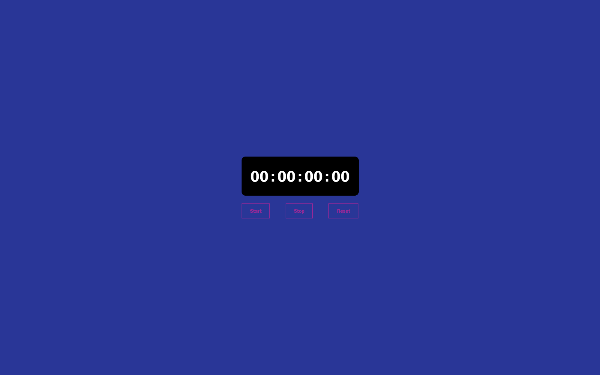

# StopWatch Web Application

1. A basic Stopwatch.
1. Made with HTML CSS AND Javascript.
1. Responsive to different screen sizes using media queries.

## Features 🚀

1. Easy to Use.
1. Display of each seconds.
1. Start, Pause and Reset.

## How to Use 🤔

1. Download or clone this repository onto your local machine.
1. Open `index.html` file located at the `./index.html` using a web browser.
1. Click on Start Button to start timer.
1. Similarly, Click on Stop Button to stop timer.
1. To Reset the stopwatch simply, click on Reset Button.

## Preview This Project

## <a href="https://codequillcrafts.github.io/Stopwatch-Web-Application/" targer=_blank >View Live At Github</a>

## <a href="https://stopwatch-codequillcrafts.netlify.app/" targer=_blank >View Live At Netlify</a>
